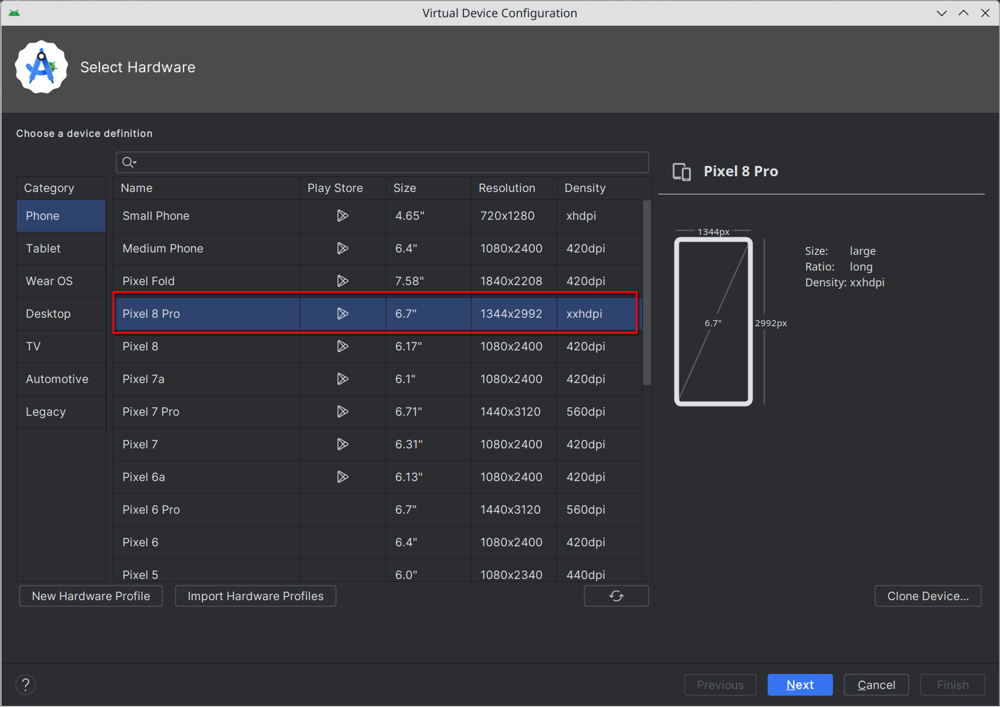
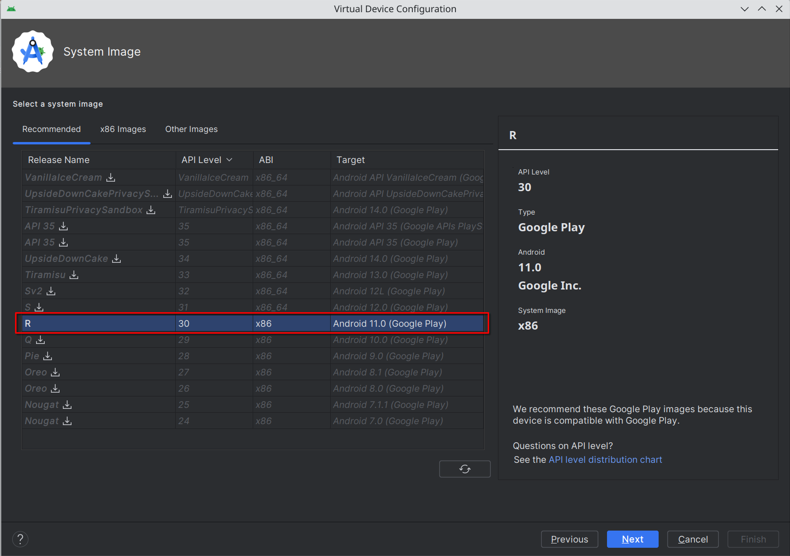

## Install CRAB

First you should install `poetry`, a modern python dependency management tool.

Then pull the crab repo and install:

```bash
git clone https://github.com/camel-ai/crab

cd crab
poetry install -E client
```

## Install Ubuntu VM

**IMPORTANT: If you are using an Ubuntu VM, the Python version in the VM must match the Python version on the host machine. If you follow this instruction to install Ubuntu, the Python version in the VM will be 3.10.12. Consider using `conda` or `pyenv` to install the same Python version on the host machine.**

Install `virt-manager`. If you are using Ubuntu or Debian, try `sudo apt install virt-manager`.

Download [Ubuntu 22.04 image](https://releases.ubuntu.com/jammy/ubuntu-22.04.4-desktop-amd64.iso), then create a new machine with at least 8G RAM and 30G disk in virt-manager using the image. Follow the instruction and complete the installation. (It's better to use `crab` as the main user name.)

After install Ubuntu, you should install crab-server on it and do necessary initilization. In Ubuntu VM, run

```bash
git clone https://github.com/camel-ai/crab.git ~/crab/
cd ~/crab/crab-benchmark-v0/scripts
chmod +x ubuntu_env_init.sh
./ubuntu_env_init.sh
```

The VM will reboot after initilization. After rebooting, remember its ip address.


## Install ADB

Download and install ADB from its [official website](https://developer.android.com/tools/releases/platform-tools).

## Install Android Emulator

You can use emulators in [Android Studio](https://developer.android.com/studio) to simulate an Android device if you
don't want to use a physical one.

To create a new virtual device, open Android Studio and use its built-in device manager to create a Pixel 8 Pro with
system image release "R".

> Note that the benchmark on our side runs on a Google Pixel 8 Pro with system image release "R". However, cases are
> noticed that Google API Level 30 may not work properly when trying to enable USB debugging mode. If such issues are 
> encountered, you can try switch to releases of lower API levels (e.g. "Q").





Then you can boot the device. To check if it's all set, run

```shell
adb devices
```

You should see the device in the list.

> Important: ADB won't work normally if you see an `unauthorized` tag after the device ID. To solve this, enable both
> the developer mode and USB debugging mode in the device.